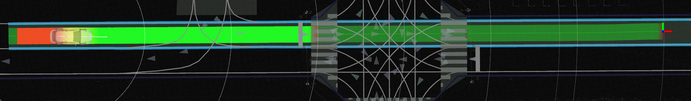
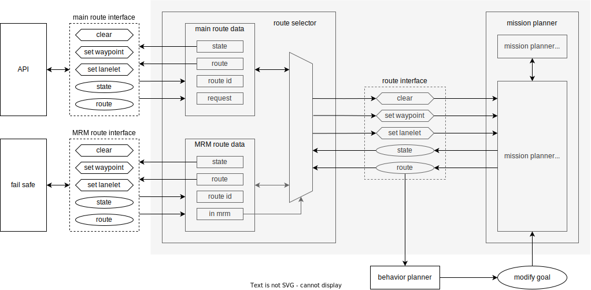
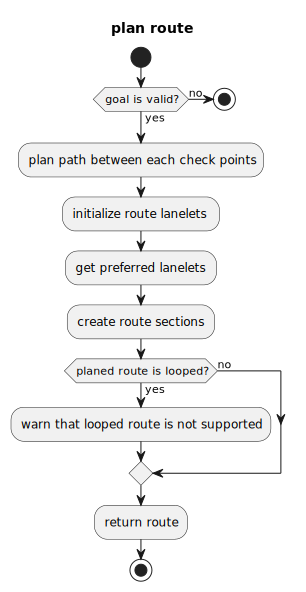

# 逻辑框架

1. 全局规划（Global Planning）阶段

    - 由 `mission_planner` 规划一个从起点到目标点的 **静态路径（route）**

    - 输出为：`autoware_planning_msgs::Route`

2. 路径细化（Route Handling & Behavior）阶段

    - `route_handler` 会从 route 中提取实际可通行的几何路径段（lanelet → path），供行为规划使用。
    - 包括临近车道、换道候选、优先路径等内容。

3. 行为规划（Behavior Path Planner）阶段

    - 根据当前状态、动态环境（障碍物、前车）等信息规划出安全的路径（path with behavior decisions）。
    - 输出为：`autoware_planning_msgs::Path`
    - 不触发 reroute 的前提下，会自己规划避障、跟车、换道等行为。
    - 局部路径替换

4. 路径跟踪控制（Control）阶段

    - 控制层根据路径输出具体控制指令（如速度、转角），驱动车辆跟随路径前进。

- 重规划阶段
    - 当遇到障碍物或突发情况后，才会进入重规划逻辑
    - 全局路径更换

# **Behavior Path Planner**

## 功能

### **模块运行逻辑**

1. **分析当前状态**（ego 车辆的位置、速度、环境感知）
2. **决策行为**：是否变道、是否停车等
3. **路径生成**：规划一个既安全又高效的路径
    - 考虑路况几何（road geometry）
    - 遵守交通规则（交通信号、限速等）
    - 规避障碍物（静态和动态（+预测），如行人、车辆、施工区域等）

### **核心功能职责 / 用例（Use Cases）**

1. **生成路径**：基于当前交通状况决定行驶路线
2. **生成可通行区域**（Drivable Area）：车可以在其中自由 maneuver
3. **生成转向灯指令**：发送信号给车辆底层系统，指示变道/转弯意图

## 组成模块

| 名称                       | 描述                                                         | LINK                                                         |
| -------------------------- | ------------------------------------------------------------ | ------------------------------------------------------------ |
| Lane Following             | 该模块从小车道中心线生成参考路径。                           |                                                              |
| Static Obstacle Avoidance  | 当存在需要避开的物体时，该模块会生成一条避开路径。           | [LINK](https://autowarefoundation.github.io/autoware_universe/main/planning/behavior_path_planner/autoware_behavior_path_static_obstacle_avoidance_module/) |
| Dynamic Obstacle Avoidance | WIP                                                          | [LINK](https://autowarefoundation.github.io/autoware_universe/main/planning/behavior_path_planner/autoware_behavior_path_dynamic_obstacle_avoidance_module/) |
| Avoidance By Lane Change   | 当存在需要避开的物体时，该模块会生成变道路径。               | [LINK](https://autowarefoundation.github.io/autoware_universe/main/planning/behavior_path_planner/behavior_path_avoidance_by_lane_change_module/README.md) |
| Lane Change                | 当需要并清除与其他车辆的碰撞检查时，执行此模块               | [LINK](https://autowarefoundation.github.io/autoware_universe/main/planning/behavior_path_planner/autoware_behavior_path_lane_change_module/) |
| External Lane Change       | WIP                                                          | LINK                                                         |
| Goal Planner               | 当本车位于正常车道，且目标车辆位于路肩车道时，执行此模块。本车将停在目标车辆处。 | [LINK](https://autowarefoundation.github.io/autoware_universe/main/planning/behavior_path_planner/autoware_behavior_path_goal_planner_module/) |
| Start Planner              | 此模块在自车静止且其轨迹位于车道肩部时执行。当自车并入道路时，此模块结束。 | [LINK](https://autowarefoundation.github.io/autoware_universe/main/planning/behavior_path_planner/autoware_behavior_path_start_planner_module/) |
| Side Shift                 | 该模块根据外部指令将路径向左或向右移动，适用于远程控制应用。 | [LINK](https://autowarefoundation.github.io/autoware_universe/main/planning/behavior_path_planner/autoware_behavior_path_side_shift_module/) |

- 所有模块都是继承于`scene_module_interface.hpp`

## Planner Manager

### 作用

- 根据自动驾驶汽车面临的具体情况**激活相关场景模块**。
    - 例如，当停放的车辆阻挡了自主车辆的行驶车道时，管理器会启动避让模块。
- 管理多个模块同时运行时的**执行顺序**。
    - 例如，如果变道模块和避让模块都处于运行状态，管理器将决定哪个模块优先运行。
- 当多个模块同时激活时，**合并来自这些模块的路径**，每个模块都会生成自己的路径，从而创建一条功能路径。

注： 

- 要检查场景模块的转换（即已注册、已批准和候选模块），请在行为路径规划器配置文件中设置 verbose: true。

## 开启禁用Modules

使用`default_preset.yaml` 和  `behavior_path_planner.launch.xml`

## 平滑路径生成

在做换道和避障时，内部用 **constant jerk lateral shift + ShiftLine 轨迹管理** 的方法，保证路径又平滑又安全，同时还能动态适应当前路况。

## 碰撞评估和安全检查机制

碰撞评估机制确保生成的路径在**执行前**和**执行中**都不会与目标物体发生碰撞，采用类 **RSS**（责任敏感安全）模型，结合预测路径和几何重叠判断，保障行驶安全。

| 模块功能     | 内容                                                    |
| ------------ | ------------------------------------------------------- |
| 安全检查时机 | 路径生成中 & 路径执行中                                 |
| 检查方法     | 基于预测轨迹插值 + 几何重叠 + RSS-inspired 安全距离模型 |
| 目标识别     | 判断是前车还是后车，决定是否追尾风险                    |
| RSS扩展区域  | 后车轮廓向后、向侧方扩展，再重叠判断                    |
| 失败情况     | 如果预测的 yaw 不准确，可能判断出错                     |

## 生成可行驶区域

### 静态可行驶区域

用于限定车辆在当前行为下可行驶的空间，结合当前模块（如避障）动态调整范围，确保既满足避让操作又不越界，同时为模块级路径生成提供约束。

| 项目             | 说明                                                |
| ---------------- | --------------------------------------------------- |
| 目标             | 限定车辆可行驶范围，提升安全性与合理性              |
| 特点             | 模块级动态生成 + 静态边界限制                       |
| 模块作用         | 每个模块生成自己的区域后传递给下一个模块            |
| 控制**扩展参数** | 额外边距、最大扩展距离、动态物体限制                |
| 安全策略         | 不允许越出 lanelet 区域，即便为了避障               |
| 技术依赖         | **Lanelet2 地图边界**、模块间路径排序、车辆包络轮廓 |

### 动态可行驶区域

动态可通行区域逻辑通过**实时扩展或收缩导航边界**，使大型车辆在复杂场景中获得足够空间完成操控，同时保持导航的安全性、合法性和计算效率。

## 生成转向灯指令

**逻辑流程概述**

1. 行为规划模块生成目标路径（含转弯、变道、避障等动作）
2. 根据动作类型+路径结构判断是否需要打灯
3. 判断是 `desired` 还是 `required`
4. 形成 `TurnIndicatorsCommand` 并下发至车辆控制接口

### **使用的消息格式**

使用 `autoware_vehicle_msgs::msg::TurnIndicatorsCommand` 消息，核心字段为 `command`，枚举类型包括：

| 枚举值         | 含义                       |
| -------------- | -------------------------- |
| `NO_COMMAND`   | 不需要任何信号灯（无操作） |
| `DISABLE`      | 明确关闭转向灯             |
| `ENABLE_LEFT`  | 打开左转向灯               |
| `ENABLE_RIGHT` | 打开右转向灯               |

# Mission planning

## 功能

规划出一条从当前位置到目标点的路线。

基于固定地图，但不依赖地图格式。

目前只使用`Lanelet2 map format`。

不考虑动态障碍物，道路变化。

可以通过插件替换规划算法。

通过 `route_selector` 复制 `mission_planner`的接口，提供给**普通模式**和**紧急模式** 下的规划。

## 架构

## 道路单元（Route section）

| `RouteSection` | 一段“可变道的车道集合”，表示路径中一小段 | LaneletSegment |
| -------------- | ---------------------------------------- | -------------- |

| LaneletSegment内容 |  概念  |
| --------------------- | ------------------------------------------------------------ |
| `LaneletPrimitive`    | 最小单位，一个 lanelet 的抽象，只包含 ID + 类型，不含几何信息 |
| `preferred_primitive` | 该段中的首选车道                                             |
| `primitives`          | 所有可能行驶的相邻车道（同方向）                             |

## 目标点验证（Goal Validation）

1. 目标点方向和车道方向夹角＜`goal_angle_threshold`
2. 车辆在目标点姿态下的箱体，在车道内

## 应用

### Mission Planner

系统接收到 **矢量地图** → 触发 vector map 回调 → 生成 `routing graph`

规划是基于已知的路由地图做的

### Route Planner

check points / start-goal
        ↓
计算check points / start-goal的最近 lanelet
        ↓
生成最短路径（Lanelet2 routing graph）
        ↓
提取主路径两侧相邻 lanelets → route_lanelets / candidate_lanelets
        ↓
判断 candidate 是否满足条件（前后接 route_lanelets）
        ↓
生成最终 route_lanelets（用于规划、变道）
        ↓
`route handler`提取 preferred lanelet primitives
        ↓
生成 route sections（路线段，用于最终导航）

### Rerouting

1. 需要离换道点有一定距离
2. 如果在非自动驾驶状态，不进行安全检测

#### 需要重规划的情况

全局规划需要被替换。

**路线变更 API**:

- 改变目的地

- 分段回路路线（固定巡航）

注：**MRM** 不允许使用这个接口进行普通重规划。

**紧急路线**

- 强制触发一次，生成最近的靠边路线

- 优先级高于普通路径规划，一旦进入**MRM**模式，普通路线会被中断

- 解除**MRM**，回到正常模式也需要重规划，并进行一次安全检查

**目标点修改**

- 这是**局部路径规划模块**根据现场环境做出的“目标点微调”，比如：
    - 避让临时停靠车辆
    - 靠边停车
    - 或者修正目标点位置等
- 如果调整后的目标点不在原先路径上，**就必须 reroute**
- 这类 goal 修改行为可以在**正常路径和 MRM 路径**中都执行
- 修改后生成的新路线会被送到 **自动驾驶的 API 接口**，以供上层应用使用（如 UI、调度系统）

| 分类              | 说明                                                         |
| ----------------- | ------------------------------------------------------------ |
| Route change API  | 正常情况下用户或系统更改目标点，不能用于 MRM 路径            |
| Emergency route   | MRM 模式专用，用于紧急靠边停车，优先级高                     |
| Goal modification | 局部路径模块对目标点的细微调整，用于规避障碍或停车           |
| Reroute 限制      | 安全性非轨迹级、需要足够缓冲距离、目标点有效性由行为规划器保证 |

# Dynamic Obstacle Avoidance

## 目的

**各模块功能说明**

| 模块名称                             | 作用描述                                                     |
| ------------------------------------ | ------------------------------------------------------------ |
| **Dynamic Avoidance Module**         | 根据目标物体的**位置和速度**，**收缩可通行区域（Drivable Area）**，即判断哪里不安全，不能走。 |
| **Obstacle Avoidance Module**        | 在限定的可通行区域中，**对路径进行微调和变形**，让路径避开障碍物。 |
| **Static Obstacle Avoidance Module** | 用于处理静止障碍物。可以让车辆绕出本车道（跨车道）来避让静态物体，但**不能处理动态目标**。 |

**避障能力对比表格解析**

| 场景分类     | **在本车道内避让**                                           | **跨车道避让**                   |
| ------------ | ------------------------------------------------------------ | -------------------------------- |
| 避让静止物体 | ✅ **Avoidance Module**（指的是 Static Obstacle Avoidance Module） | ✅ **Avoidance Module**           |
| 避让动态物体 | ✅ **Dynamic Avoidance Module + Obstacle Avoidance Module**   | ❌ 暂无可用模块（**正在开发中**） |

## 内部算法的策略

### 是否避让障碍物的判断逻辑

**判断依据**

- **障碍物的预测路径**（predicted path）
- **障碍物的当前状态**：位置（pose）+ 速度（twist）
- **设定中允许避让的对象类型**（如：行人、自行车、车辆等）

**两个核心判断标准**

| 判断标准              | 含义                                                         |
| --------------------- | ------------------------------------------------------------ |
| **是否“阻碍”ego通行** | 判断障碍物是否在一定时间内会与 ego 发生碰撞（例如几秒内）    |
| **是否“可安全避让”**  | 判断在 lateral acceleration（横向加速度）和 lateral jerk（横向加加速度）限制内是否能避让成功（避免乘客不适或超出车辆动力学能力） |

### 对选中的障碍物“切除”可通行区域

**目标**

将需要避让的障碍物“从 drivable area 中排除掉”，以便后续轨迹规划模块不会生成穿过这些障碍物的路径。

**输入数据**

- 障碍物的 **姿态（pose）**
    - 注意：**不使用 predicted path**，因为当前预测精度不够高
    - 假设障碍物是**平行于 ego 车路径**运动的（简化模型）

**切除方式**

- **矩形裁剪**（rectangular cutout）：
    - 沿着 ego 的路径方向创建一个矩形区域作为“不可通行区域”
    - 这样可以将**二维几何问题简化为一维标量问题**（例如只在路径上的 s 坐标上进行判断），提高效率

#### **横向尺寸的确定**

**公式概念：**

**polygon lateral width = 障碍物宽度 + lat_offset_from_obstacle**

- **`obstacle width`**：障碍物自身的宽度。
- **`lat_offset_from_obstacle`**：配置参数，表示在障碍物边缘基础上再向外扩展的横向冗余边距（例如 0.5m），用来为避让留出安全余量。

**限制条件：**

**最大横向偏移限制 = `max_lat_offset_to_avoid`**

- 防止生成的避让区域太宽，影响正常行驶或产生不合理轨迹。

#### 纵向尺寸的确定

| 类型       | 处理策略                                                     |
| ---------- | ------------------------------------------------------------ |
| 同向障碍物 | 判断 TTC，TTC < 0 则忽略                                     |
| 反向障碍物 | 通常较危险，TTC 较小时就应避让或停车，但具体行为依赖策略设置 |

**同向：**

**反向：**

#### **整体流程简述：**

1. **识别障碍物**（基于感知与预测模块）
2. **判断是否需避让**（参考 TTC、类型、可避让性）
3. **构造禁行多边形区域**：
    - 横向尺寸 = 宽度 + 安全边距（受最大偏移限制）
    - 纵向尺寸 = 根据 TTC 判断生成长度

### 行人避让的可通行区域裁剪逻辑

**核心目标：**

**生成一块合理的避让区域（polygon），将行人的可达区域从自车可通行区域中“裁剪”掉**，同时**保留自车所需的最小安全通行空间**，避免剧烈方向调整或危险动作。

**步骤解析：**

1. **认为行人拥有优先通行权**

- 行人是高优先级障碍物，因此即使 ego 路径是直行，若行人处于可能穿越路径中，也需做避让处理。

2. **预测行人路径并设置信心区间**

- 选取预测路径中具有**高可信度（confidence）**的部分；
- **设置一个特定时间段**，在这段时间内预测行人可能到达的区域；
- 以此生成一个 **“行人占据区域 polygon”**。

根据每个行人的预测路径生成限制区域

3. **加入最小安全距离（margin）**

- 在行人预测区域基础上，加上配置的 **最小避让冗余边距**，保证不只是刚好避开，而是提供一定冗余空间。

4. **同时构造自车的“安全保持区”**

- 为了避免产生突兀的方向调整或急转，自车在路径周围还要有一个 **“自车路径缓冲区 polygon”**；
- 该区域用来限制自车避让动作的急剧程度，相当于对轨迹平滑性与乘客舒适性的保护。

5. **最终可通行区域裁剪**

**最终的可通行区域 = 原始可通行区域 - (行人区域 polygon - 自车缓冲 polygon)**

- 也就是说，如果某部分行人区域落在自车缓冲区范围内，就**暂时不从可通行区域中裁掉**，优先保障自车轨迹的连续性与稳定性；
- 如果完全在缓冲区之外，则该区域会被视为**不可通行区域并裁剪**。

自车的最低要求优先考虑对象边距

